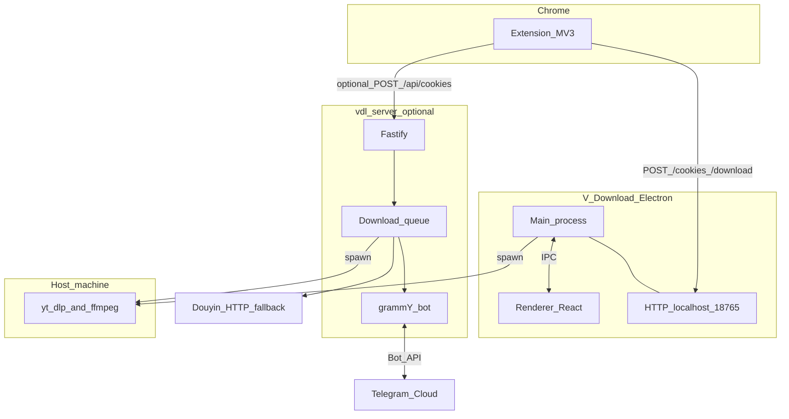

<p align="center">
  <a href="README.md">English</a> | <a href="README-CN.md">中文</a>
</p>

<p align="center">
  
</p>

<h1 align="center">V-Download</h1>

<p align="center">
  一款类似 Downie 的桌面应用 + Chrome 扩展，支持从 YouTube、X/Twitter、抖音及任意网站下载视频，基于 <code>yt-dlp</code> 驱动。
</p>

<p align="center">
  
  
  
</p>

---

## 仓库概览

本仓库包含 **两个相关产品** 和一个 **共享库**：

| 部分 | 作用 |
|------|------|
| **V-Download** | macOS **Electron** 应用 + **React** 界面 + [Chrome 扩展](extension/)，本地下载（`Cmd+V`、格式选择、媒体嗅探）。 |
| **vdl-server** | 可选的 **Telegram 机器人**（[vdl-server/](vdl-server/)）：Fastify HTTP、下载队列、临时链接、抖音回退 — 同样依赖 **yt-dlp** / **ffmpeg**。 |
| **@v-download/shared** | [packages/shared](packages/shared)：Netscape Cookie 与域名列表；在仓库根目录执行 `npm install` 会构建该包并运行 [`sync:extension-constants`](package.json)，以更新 [extension/cookie-sync-domains.js](extension/cookie-sync-domains.js)。 |

**延伸阅读：** [docs/DESIGN_PLAN.md](docs/DESIGN_PLAN.md)（黑白重设计总览与阶段）、[vdl-server/README.md](vdl-server/README.md)（机器人快速开始与环境变量）、[vdl-server/DEPLOYMENT.md](vdl-server/DEPLOYMENT.md)（隧道/生产部署）、[docs/MANUAL_TESTING.md](docs/MANUAL_TESTING.md)（手动与 E2E 测试清单）、[docs/CLI_AND_SHARED_CORE.md](docs/CLI_AND_SHARED_CORE.md)（下载核心 / CLI 规划）、[docs/FUTURE_ENHANCEMENTS.md](docs/FUTURE_ENHANCEMENTS.md)（抖音 / 无头浏览器后续改进与调研，英文）。

## 设计

- **[docs/DESIGN_PLAN.md](docs/DESIGN_PLAN.md)** — 端到端设计计划：愿景、设计令牌、信息架构、界面目录、阶段划分、无障碍与治理说明。
- **[design/v-download-bw-redesign-pack/](design/v-download-bw-redesign-pack/)** — 设计稿（PNG/PDF）、[specs/redesign-spec.md](design/v-download-bw-redesign-pack/specs/redesign-spec.md)、[tokens/design-tokens.json](design/v-download-bw-redesign-pack/tokens/design-tokens.json) 与 [index.html](design/v-download-bw-redesign-pack/index.html) 设计看板。

## 功能特性

- **一键下载** — 使用 `Cmd+V` 粘贴任意 URL 或通过 Chrome 扩展一键发送
- **全站媒体检测** — 自动嗅探 HLS (m3u8)、MP4、WebM、FLV 媒体流
- **视频悬浮按钮** — 检测到的视频元素上会自动出现下载按钮（类似 AIX Downloader）
- **Chrome 扩展** — 在每个页面检测媒体流，发现多个时弹出选择器供用户挑选
- **YouTube 集成** — YouTube 页面一键下载，支持格式选择（4K 到 144p、MP3）
- **X/Twitter 集成** — 推文视频自动出现下载按钮（操作栏 + 视频叠加层），发送推文链接至 yt-dlp 获取最佳画质
- **抖音集成** — 专属下载面板，支持完整画质选项、封面图片、音乐提取（通过 React Fiber 提取元数据）
- **应用端嗅探** — 对于 yt-dlp 不支持的站点，应用会在隐藏浏览器中加载页面并自动检测媒体流
- **播放列表 & 频道支持** — 下载完整播放列表或频道，自动按子文件夹整理
- **并发下载** — 可配置的并行下载队列（1-10 个同时下载）
- **Dock 进度动画** — macOS Dock 图标从上到下填充动画，实时显示下载速度（如 `12 MB/s`）
- **实时进度** — 实时进度条、网速、剩余时间、下载阶段（视频/音频/合并）
- **下载管理** — 暂停、恢复、重试、取消、删除单个或全部任务
- **Cookie 同步** — 自动从 Chrome 同步 YouTube Cookie，用于需要登录的下载
- **崩溃恢复** — 检测到中断的下载，重启后可继续
- **暗色 UI** — 简洁的深色主题，黑白配色

## 截图

<p align="center">
  <em>主窗口：活跃下载、播放列表分组、实时进度</em>
</p>

## 前置依赖

使用前请先安装以下依赖：

```bash
# 通过 Homebrew 安装 yt-dlp 和 ffmpeg
brew install yt-dlp ffmpeg
```

| 依赖 | 用途 |
|------|------|
| [yt-dlp](https://github.com/yt-dlp/yt-dlp) | 视频下载引擎 |
| [ffmpeg](https://ffmpeg.org/) | 合并视频 + 音频流 |

## 抖音页面与 CloakBrowser（可选）

抖音链接可能需要在**隐藏 Electron 窗口**里执行页面脚本才能得到可解析的数据。若仍超时或被风控，可在 **设置** 中开启 **「Use CloakBrowser for Douyin (beta)」**。

- **CloakBrowser**（[CloakHQ/cloakbrowser](https://github.com/CloakHQ/cloakbrowser)）会启动**单独的加固 Chromium**（首次约 **200 MB** 下载到厂商缓存目录，**不会**打进 DMG）。
- **许可：** npm 包为 MIT；**浏览器二进制**另有条款（[BINARY-LICENSE.md](https://github.com/CloakHQ/cloakbrowser/blob/main/BINARY-LICENSE.md)），一般**不可再分发**二进制；本应用仅在您勾选后触发本机下载。
- **macOS：** 缓存内的二进制可能触发 **Gatekeeper**；详见 CloakBrowser README。macOS 上补丁说明少于 Linux/Windows。
- **环境变量：** `V_DOWNLOAD_CLOAKBROWSER=1` 强制使用 CloakBrowser；`V_DOWNLOAD_CLOAK_FALLBACK=1` 在 Electron 超时后再试一次 CloakBrowser。

请遵守抖音服务条款，仅用于合法的个人用途。

## 安装

### 从 DMG 安装（推荐）

1. 从 [Releases](https://github.com/wangm12/v-download/releases) 下载最新的 `.dmg` 文件
2. 打开 DMG，将 **V-Download** 拖入「应用程序」文件夹
3. 首次启动：右键点击 → 打开（因为应用未签名）

### 从源码构建

```bash
git clone https://github.com/wangm12/v-download.git
cd v-download
npm install
npm run build:mac
```

`npm install` 会构建 workspace 包 `@v-download/shared` 并重新生成 Chrome 扩展所需的 `extension/cookie-sync-domains.js`。

构建产物位于 `dist/mac-arm64/V-Download.app`，DMG 在 `dist/` 目录。

### 粘贴 URL

1. 复制任意视频 URL（YouTube、直接媒体链接、或任何包含嵌入视频的网页）
2. 聚焦应用窗口，按 `Cmd+V`
3. YouTube 链接：在弹窗中选择格式/画质
4. 其他站点：应用先尝试 yt-dlp，失败后回退到内置媒体嗅探器 — 如果检测到多个流，会弹出选择器让你挑选
5. 下载自动开始

### Chrome 扩展

1. 在 Chrome 中加载 `extension/` 文件夹：`chrome://extensions` → 开发者模式 → 加载已解压的扩展程序
2. 扩展图标在每个页面都处于激活状态
3. **YouTube 页面** — 点击图标直接发送 URL 到应用
4. **X/Twitter 页面** — 含视频的推文自动出现下载按钮（操作栏和视频播放器上），点击即发送至 yt-dlp
5. **抖音页面** — 当前视频上方出现下载按钮，支持完整画质选择、封面图片、音乐下载
6. **其他页面** — 检测到的视频元素上会出现下载叠加按钮；点击扩展图标可打开弹窗查看所有检测到的媒体流（HLS、MP4、WebM、FLV）
7. Cookie 每 5 分钟自动同步一次，确保认证下载正常工作

### 快捷键

| 快捷键 | 功能 |
|--------|------|
| `Cmd+V` | 粘贴 URL 并开始下载 |
| `Cmd+,`（macOS）/ `Ctrl+,`（Windows/Linux） | 打开偏好设置 |
| `Cmd+W` | 隐藏窗口（应用保留在 Dock） |
| `Cmd+Q` | 退出应用 |

## 设置

偏好设置**在主窗口内**打开（侧栏 **Preferences…**、底部栏设置按钮，或 **Cmd+,** / **Ctrl+,**），不再使用单独设置窗口。下表为本地保存的选项：

| 设置项 | 默认值 | 说明 |
|--------|--------|------|
| 下载位置 | `~/Downloads` | 文件保存路径 |
| 并发下载数 | 3 | 并行下载数量（1–10） |
| 显示格式选择框 | 开启 | 下载前弹出格式/画质选择 |
| 播放列表子文件夹 | 开启 | 播放列表下载按子文件夹整理 |
| 默认视频画质 | 1080p | 关闭格式选择框时使用 |
| 默认音频品质 | 320kbps | 关闭格式选择框时使用 |
| 下载间隔 | 3秒 | 队列中每个下载之间的等待时间（用于限速保护） |
| 抖音用 CloakBrowser（测试） | 关闭 | 可选：用 CloakBrowser 的 Chromium 拉取抖音页面（见上文「抖音页面与 CloakBrowser」） |

## 架构

扩展可同时连接 **本机桌面应用** 与 **可选的 vdl-server**（若已启动）：



- **桌面路径：** 渲染进程负责 UI；主进程运行 [ytdlp.ts](src/main/ytdlp.ts)、[downloadManager.ts](src/main/downloadManager.ts)、[localServer.ts](src/main/localServer.ts)，在 **18765** 端口为扩展提供 HTTP。
- **扩展：** 内容脚本做媒体检测与页面 UI；[background.js](extension/background.js) 转发 URL，并按域名列表定期同步 Cookie（通过 `importScripts('cookie-sync-domains.js')`）。
- **vdl-server：** [index.ts](vdl-server/src/index.ts) 提供健康检查、Cookie 上传、静态文件与 Telegram Webhook；[queue.ts](vdl-server/src/queue.ts) 调用 yt-dlp 或 [douyin.ts](vdl-server/src/douyin.ts) 回退；[bot/index.ts](vdl-server/src/bot/index.ts) 发送视频或临时链接。当 `BASE_URL` 为 `https://...` 时使用 **Webhook**，否则为 **长轮询**。
- **机器人 Cookie：** 若要让扩展同步的 Netscape Cookie 以 `--cookies` 传给 yt-dlp，请将服务器 **`COOKIE_MODE=file`**（详见 [vdl-server/README.md](vdl-server/README.md)）；默认 `browser` 读取的是 **服务器本机** Chrome 配置，而非上传的文件。

### 技术栈

| 层级 | 技术 |
|------|------|
| 桌面运行时 | Electron 33 |
| 桌面构建 | electron-vite, Vite |
| 前端 | React 19, TypeScript |
| 样式 | Tailwind CSS, Radix UI, Lucide React |
| 3D | Three.js, React Three Fiber |
| 桌面数据库 | better-sqlite3 (SQLite) |
| 打包 | electron-builder |
| 下载引擎 | yt-dlp + ffmpeg（外部依赖，两应用共用） |
| vdl-server | Node 20+, Fastify, grammY, better-sqlite3 |
| 共享包 | TypeScript [packages/shared](packages/shared)，npm workspaces |

### 项目结构

```
vdl-server/                 # Telegram 机器人 + Fastify（详见 vdl-server/README.md）
├── src/
├── scripts/
├── Dockerfile
├── docker-compose.yml
└── Makefile

packages/shared/            # @v-download/shared — Cookie 与域名列表（应用 + 服务端 + 扩展生成）
├── src/
└── README.md

docs/
├── DESIGN_PLAN.md             # 黑白重设计总览与 mockup 阶段
├── MANUAL_TESTING.md          # 回归与 E2E 清单（含 mockup 对照表）
├── CLI_AND_SHARED_CORE.md     # 下载核心 / CLI 规划
└── FUTURE_ENHANCEMENTS.md     # 抖音 / Chromium / CloakBrowser 后续规划（英文正文）

scripts/
└── write-extension-cookie-sync.mjs   # 由 npm run sync:extension-constants 调用

src/                        # Electron 应用（主进程 + 渲染进程）
├── main/
│   ├── index.ts
│   ├── downloadManager.ts
│   ├── dockProgress.ts
│   ├── ytdlp.ts
│   ├── mediaSniffer.ts
│   ├── database.ts
│   ├── settings.ts
│   └── localServer.ts      # 扩展 HTTP 服务 :18765
├── preload/
└── renderer/
    └── src/
        ├── App.tsx
        ├── components/
        └── hooks/

extension/                  # Chrome 扩展 (Manifest V3)
├── cookie-sync-domains.js  # 自动生成，勿手改（运行 sync:extension-constants）
├── manifest.json
├── background.js
├── popup.html / popup.js / popup.css
├── content*.js / content*.css
└── content-douyin-bridge.js
```

## 如何使用本仓库

| 目标 | 操作 |
|------|------|
| **运行 macOS 应用** | 安装 [前置依赖](#前置依赖)，再按 [安装](#安装) 或开发使用 `npm run dev`。 |
| **使用扩展** | 在 Chrome 中加载 [`extension/`](extension/) 目录；桌面应用需运行以提供 `127.0.0.1:18765`。 |
| **修改 Cookie 同步域名** | 编辑 [packages/shared/src/cookie-sync-domains.ts](packages/shared/src/cookie-sync-domains.ts)，在仓库根目录执行 `npm run sync:extension-constants`，然后重新加载扩展。 |
| **从仓库根目录运行 vdl（Make）** | 执行 `make help` 查看列表。常用：`make vdl-install`、`make vdl-build`、`make vdl-dev`（轮询）、`make vdl-server`（Cloudflare 隧道 + 服务）、`make vdl-docker-build` / `make vdl-docker-up`（Docker；compose 工作目录仍在 `vdl-server/`）。 |
| **运行 Telegram 机器人** | 将 `.env` 放在 [`vdl-server/`](vdl-server/)（见 [vdl-server/README.md](vdl-server/README.md)）。可在**仓库根目录**使用 **`make vdl-*`**，或 **`cd vdl-server`** 按该 README 操作（`make server`、Docker）。扩展向机器人同步 Cookie 且希望 yt-dlp 使用该文件时，请使用 **`COOKIE_MODE=file`**。 |
| **部署机器人** | 见 [vdl-server/DEPLOYMENT.md](vdl-server/DEPLOYMENT.md)。 |
| **发版前测试** | 见 [docs/MANUAL_TESTING.md](docs/MANUAL_TESTING.md)。 |
| **后续改进 / 调研** | 见 [docs/FUTURE_ENHANCEMENTS.md](docs/FUTURE_ENHANCEMENTS.md)（抖音 hydration、URL/解析、可选 CloakBrowser）。 |

粘贴 URL、快捷键、设置等日常用法见下文 [使用方法](#使用方法) 与 [设置](#设置)。

## 开发

```bash
# 安装依赖（构建 @v-download/shared、重新生成 extension/cookie-sync-domains.js、electron-builder 原生依赖）
npm install

# 桌面 — 热重载
npm run dev

# 桌面 — 生产构建（输出在 out/）
npm run build

# 桌面 — 打包 macOS .app + DMG
npm run build:mac

# 仅重新生成扩展域名列表（修改 packages/shared 后）
npm run sync:extension-constants

# 查看所有 Makefile 目标（桌面 + vdl-server）
make help

# 在仓库根目录操作 vdl-server（等价于 cd vdl-server && …）
make vdl-install
make vdl-dev
```

**Telegram 机器人：**在仓库根目录使用 **`make vdl-*`**（见 `make help`），或 `cd vdl-server && npm install && npm run dev` — 完整步骤见 [vdl-server/README.md](vdl-server/README.md)。

## Chrome 扩展开发

1. 打开 `chrome://extensions`
2. 启用**开发者模式**
3. 点击**加载已解压的扩展程序**，选择 `extension/` 文件夹
4. 文件修改后扩展会自动重载

## 许可证

MIT
