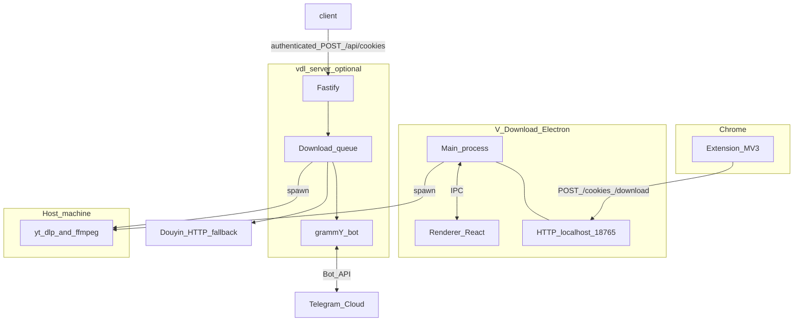

<p align="center">
  <a href="README.md">English</a> | <a href="README-CN.md">中文</a>
</p>

<p align="center">
  
</p>

<h1 align="center">V-Download</h1>

<p align="center">
  A Downie-style desktop app + Chrome extension for downloading videos from YouTube, X/Twitter, Douyin, and any website, powered by <code>yt-dlp</code>.
</p>

<p align="center">
  
  
  
</p>

---

## Repository overview

This repository ships **two related products** and a small **shared library**:

| Part | Role |
|------|------|
| **V-Download** | macOS **Electron** app + **React** UI + [Chrome extension](extension/) for local downloads (`Cmd+V`, format picker, media sniffer). |
| **vdl-server** | Optional **Telegram bot** ([vdl-server/](vdl-server/)): Fastify HTTP API, download queue, temp links, Douyin fallback — uses the same **yt-dlp** / **ffmpeg** toolchain. |
| **@v-download/shared** | [packages/shared](packages/shared): Netscape cookie helpers + domain list for cookie sync; root `npm install` builds it and runs [`sync:extension-constants`](package.json) so [extension/cookie-sync-domains.js](extension/cookie-sync-domains.js) stays in sync. |

**Read next:** [docs/DESIGN_PLAN.md](docs/DESIGN_PLAN.md) (monochrome redesign master plan & phases), [vdl-server/README.md](vdl-server/README.md) (bot quick start & env), [vdl-server/DEPLOYMENT.md](vdl-server/DEPLOYMENT.md) (tunnel / production), [docs/MANUAL_TESTING.md](docs/MANUAL_TESTING.md) (manual & E2E checklist), [docs/CLI_AND_SHARED_CORE.md](docs/CLI_AND_SHARED_CORE.md) (roadmap for a shared downloader / CLI), [docs/FUTURE_ENHANCEMENTS.md](docs/FUTURE_ENHANCEMENTS.md) (Douyin / headless research backlog).

## Design

- **[docs/DESIGN_PLAN.md](docs/DESIGN_PLAN.md)** — End-to-end design plan: vision, tokens, IA, screen catalog, phases, accessibility, governance.
- **[design/v-download-bw-redesign-pack/](design/v-download-bw-redesign-pack/)** — Mockups (PNG/PDF), [specs/redesign-spec.md](design/v-download-bw-redesign-pack/specs/redesign-spec.md), [tokens/design-tokens.json](design/v-download-bw-redesign-pack/tokens/design-tokens.json), and [index.html](design/v-download-bw-redesign-pack/index.html) design board.

## Features

- **One-click download** — Paste any URL with `Cmd+V` or click the companion Chrome extension
- **Universal media detection** — Sniffs HLS (m3u8), MP4, WebM, and FLV streams from any website
- **Video overlay button** — An in-page download button appears on any detected video element (similar to AIX Downloader)
- **Chrome extension** — Detects media streams on every page; shows a picker when multiple streams are found
- **YouTube integration** — One-click download on YouTube pages with format selection (4K to 144p, MP3)
- **X/Twitter integration** — Download buttons on tweets with video (action bar + video overlay); sends tweet URL to yt-dlp for full quality download
- **Douyin integration** — Dedicated download panel with full quality options, cover images, and music extraction via React fiber inspection
- **App-side sniffer** — For sites yt-dlp doesn't support, the app loads the page in a hidden browser and detects streams automatically
- **Playlist & channel support** — Download entire playlists or channels with organized subfolders
- **Concurrent downloads** — Configurable parallel download queue (1-10 simultaneous)
- **Dock progress animation** — macOS dock icon fills top-to-bottom during downloads with live speed display (e.g. `12 MB/s`)
- **Real-time progress** — Live progress bar, network speed, ETA, and download phase (video/audio/merging)
- **Download management** — Pause, resume, retry, cancel, and delete individual or all tasks
- **Explicit cookie sync** — Syncs supported site cookies from Chrome only after the user requests it; cookies stay on the local desktop app by default
- **Crash recovery** — Interrupted downloads are detected and can be resumed on restart
- **Dark UI** — Clean, minimal dark theme with black and white accents

## Screenshots

<p align="center">
  <em>Main window with active downloads, playlist groups, and real-time progress</em>
</p>

## Prerequisites

Before using V-Download, install these dependencies:

```bash
# Install yt-dlp and ffmpeg via Homebrew
brew install yt-dlp ffmpeg
```

| Dependency | Purpose |
|-----------|---------|
| [yt-dlp](https://github.com/yt-dlp/yt-dlp) | Video downloading engine |
| [ffmpeg](https://ffmpeg.org/) | Merging video + audio streams |

## Douyin hydration & CloakBrowser (optional)

For Douyin, the app may open the page in a **hidden Electron window** so embedded video JSON can render. If pages still time out or look like a bot wall, enable **Use CloakBrowser for Douyin (beta)** in **Settings**.

- **CloakBrowser** ([CloakHQ/cloakbrowser](https://github.com/CloakHQ/cloakbrowser)) is a **separate patched Chromium** controlled via Playwright. The first run downloads roughly **~200 MB** into the vendor’s **local cache** (the DMG does **not** ship that binary).
- **License:** The npm package is MIT; the **downloaded browser binary** has its own terms ([BINARY-LICENSE.md](https://github.com/CloakHQ/cloakbrowser/blob/main/BINARY-LICENSE.md)) — typically **no redistribution** of the binary with another product without legal review. This app only triggers an **end-user download** when you opt in.
- **macOS:** The cached binary may be **ad-hoc signed**. Gatekeeper can block or warn until you allow it under **System Settings → Privacy & Security**, or after clearing quarantine on the cache path (see CloakBrowser’s README). Fewer fingerprint patches are documented for macOS than Linux/Windows.
- **Environment overrides:** `V_DOWNLOAD_CLOAKBROWSER=1` forces CloakBrowser (same as the setting). `V_DOWNLOAD_CLOAK_FALLBACK=1` keeps Electron first and tries CloakBrowser **once** if Electron hydration times out.

Use only in line with Douyin’s terms and for legitimate personal access.

## Installation

### From DMG (recommended)

1. Download the latest `.dmg` from [Releases](https://github.com/wangm12/v-download/releases)
2. Open the DMG and drag **V-Download** to your Applications folder
3. Official notarized builds should open normally; source or ad-hoc builds may require right-click → Open on first launch

### Build from source

```bash
git clone https://github.com/wangm12/v-download.git
cd v-download
npm install
npm run build:mac
```

`npm install` builds the workspace package `@v-download/shared` and regenerates `extension/cookie-sync-domains.js` for the Chrome extension.

The built app will be in `dist/mac-arm64/V-Download.app` and a DMG installer in `dist/`.

## Usage

### Paste a URL

1. Copy any video URL (YouTube, direct media link, or any webpage with embedded video)
2. Focus the app window and press `Cmd+V`
3. For YouTube: choose format/quality in the dialog
4. For other sites: the app tries yt-dlp first, then falls back to its built-in media sniffer — if multiple streams are found, a picker dialog lets you choose which to download
5. Download begins automatically

### Chrome Extension

1. Load the `extension/` folder in Chrome via `chrome://extensions` (Developer mode → Load unpacked)
2. The extension icon is always active on every page
3. **YouTube pages** — Click the icon to send the URL directly to the app
4. **X/Twitter pages** — Download buttons appear on tweets with video (in the action bar and on the video player); click to send to yt-dlp
5. **Douyin pages** — A download button appears on the active video with full quality selection, cover image, and music download
6. **Other pages** — A download overlay appears on detected video elements; click the extension icon to open a popup showing all detected media streams (HLS, MP4, WebM, FLV)
7. Cookies are synced only after you click **Sync cookies** in the app; the extension does not upload cookies to the optional server automatically
8. **Cold start** — If the desktop app is not running, the extension opens `vdownload://wake` from the **same click** as the download (or from the extension popup) so Chrome ties the request to that page and can offer **“Always allow … to open links of this type”**. Install the **packaged** V-Download build from `/dist` (or your release); the dev `npm run dev` binary does not register URL schemes and should not be the default handler. If Chrome still says **“Open Electron?”**, choose **V-Download** in `/Applications` (or your install location) instead of any `Electron.app` under `node_modules`, then try again.

### Keyboard Shortcuts

| Shortcut | Action |
|----------|--------|
| `Cmd+V` | Paste URL and start download |
| `Cmd+,` (macOS) / `Ctrl+,` (Windows/Linux) | Open Preferences |
| `Cmd+W` | Hide window (app stays in dock) |
| `Cmd+Q` | Quit app |

## Settings

Preferences open **inside the main window** (sidebar **Preferences…**, bottom bar settings control, or **Cmd+,** / **Ctrl+,**); they are not a separate window. The following options are stored locally:

| Setting | Default | Description |
|---------|---------|-------------|
| Download location | `~/Downloads` | Where files are saved |
| Concurrent downloads | 3 | Parallel downloads (1–10) |
| Show format dialog | On | Prompt for format/quality before downloading |
| Playlist subfolder | On | Organize playlist downloads into subfolders |
| Default video quality | 1080p | Used when format dialog is off |
| Default audio quality | 320kbps | Used when format dialog is off |
| Delay between downloads | 3s | Pause between starting queued downloads (rate limit mitigation) |
| Use CloakBrowser for Douyin (beta) | Off | Optional patched Chromium for Douyin hydration; see [Douyin hydration & CloakBrowser](#douyin-hydration--cloakbrowser-optional) |

## Architecture

High-level data flow (extension can talk to **both** the desktop app and vdl-server when the latter is running):



- **Desktop path:** Renderer controls UI; main process runs [ytdlp.ts](src/main/ytdlp.ts), [downloadManager.ts](src/main/downloadManager.ts), [localServer.ts](src/main/localServer.ts) on port **18765** for the extension.
- **Extension:** Content scripts detect media / inject UI; [background.js](extension/background.js) forwards URLs and handles explicit local cookie sync (see `COOKIE_SYNC_DOMAINS` via `importScripts('cookie-sync-domains.js')`).
- **vdl-server path:** [index.ts](vdl-server/src/index.ts) serves health, cookie upload, static files, and Telegram webhook; [queue.ts](vdl-server/src/queue.ts) runs yt-dlp or [douyin.ts](vdl-server/src/douyin.ts) fallback; [bot/index.ts](vdl-server/src/bot/index.ts) sends videos or temp links. When `BASE_URL` is `https://...`, the bot uses **webhooks**; otherwise **polling**.
- **Cookies on the bot:** The server’s `/api/cookies` endpoint is disabled unless `COOKIE_SYNC_TOKEN` is configured. For authenticated uploads, set **`COOKIE_MODE=file`** (see [vdl-server/README.md](vdl-server/README.md)); default `browser` reads Chrome on the **server host**, not an uploaded file.

### Tech stack

| Layer | Technology |
|-------|-----------|
| Desktop runtime | Electron 33 |
| Desktop build | electron-vite, Vite |
| Frontend | React 19, TypeScript |
| Styling | Tailwind CSS, Radix UI, Lucide React |
| 3D | Three.js, React Three Fiber |
| Desktop DB | better-sqlite3 (SQLite) |
| Packaging | electron-builder |
| Download engine | yt-dlp + ffmpeg (external, both apps) |
| vdl-server | Node 20+, Fastify, grammY, better-sqlite3 |
| Shared package | TypeScript [packages/shared](packages/shared), npm workspaces |

### Project structure

```
vdl-server/                 # Telegram bot + Fastify (see vdl-server/README.md)
├── src/
├── scripts/
├── Dockerfile
├── docker-compose.yml
└── Makefile

packages/shared/            # @v-download/shared — cookies + domain list for app + server + extension gen
├── src/
└── README.md

docs/
├── DESIGN_PLAN.md             # Monochrome redesign master plan & mockup phases
├── MANUAL_TESTING.md          # Regression & E2E checklist (+ mockup vs build matrix)
├── CLI_AND_SHARED_CORE.md     # Downloader / CLI roadmap
└── FUTURE_ENHANCEMENTS.md     # Douyin / Chromium / CloakBrowser backlog

scripts/
└── write-extension-cookie-sync.mjs   # Called from npm run sync:extension-constants

src/                        # Electron app (main + renderer)
├── main/
│   ├── index.ts            # App entry, windows, IPC handlers
│   ├── downloadManager.ts  # Queue, concurrency, task lifecycle
│   ├── dockProgress.ts     # macOS dock icon animation + speed badge
│   ├── ytdlp.ts            # yt-dlp CLI wrapper
│   ├── mediaSniffer.ts     # Hidden browser media stream detection
│   ├── database.ts         # SQLite persistence
│   ├── settings.ts         # JSON settings store
│   └── localServer.ts      # HTTP server for Chrome extension (:18765)
├── preload/
│   ├── index.ts
│   └── index.d.ts
└── renderer/
    └── src/
        ├── App.tsx
        ├── components/     # UI: DownloadItem, FormatDialog, PreferencesPanel, …
        └── hooks/

extension/                  # Chrome Extension (Manifest V3)
├── cookie-sync-domains.js  # Generated — do not hand-edit (run sync:extension-constants)
├── manifest.json
├── background.js
├── popup.html / popup.js / popup.css
├── content*.js / content*.css
└── content-douyin-bridge.js
```

## How to use this repository

| Goal | What to do |
|------|----------------|
| **Run the macOS app** | Install [Prerequisites](#prerequisites), then [Installation](#installation) / `npm run dev` for development. |
| **Use the extension** | Load the [`extension/`](extension/) folder in Chrome; keep the desktop app running for `127.0.0.1:18765`. |
| **Change cookie sync domains** | Edit [packages/shared/src/cookie-sync-domains.ts](packages/shared/src/cookie-sync-domains.ts), then run `npm run sync:extension-constants` at the repo root and reload the extension. |
| **vdl-server from repo root (Make)** | Run `make help` for a list. Common: `make vdl-install`, `make vdl-build`, `make vdl-dev` (polling), `make vdl-server` (Cloudflare tunnel + server), `make vdl-docker-build` / `make vdl-docker-up` (Docker; compose cwd is still `vdl-server/`). |
| **Run the Telegram bot** | Put `.env` in [`vdl-server/`](vdl-server/) (see [vdl-server/README.md](vdl-server/README.md)). Use **`make vdl-*`** from the repo root **or** `cd vdl-server` and follow that README (`make server`, Docker). Set **`COOKIE_SYNC_TOKEN`** before accepting authenticated cookie uploads. |
| **Deploy the bot** | See [vdl-server/DEPLOYMENT.md](vdl-server/DEPLOYMENT.md) (tunnel, webhook, database). |
| **Test releases** | See [docs/MANUAL_TESTING.md](docs/MANUAL_TESTING.md). |
| **Future / research backlog** | See [docs/FUTURE_ENHANCEMENTS.md](docs/FUTURE_ENHANCEMENTS.md) (Douyin hydration, URL/parser work, optional CloakBrowser). |

Desktop usage details (paste URL, shortcuts, settings) are in [Usage](#usage) and [Settings](#settings) below.

## Development

```bash
# Install dependencies (builds @v-download/shared + regenerates extension/cookie-sync-domains.js, then electron-builder native deps)
npm install

# Desktop — hot reload
npm run dev

# Desktop — production build (output in out/)
npm run build

# Desktop — package macOS .app + DMG
npm run build:mac

# Regenerate extension domain list only (after editing packages/shared)
npm run sync:extension-constants

# All Makefile targets (desktop + vdl-server)
make help

# vdl-server from repo root (same as cd vdl-server && …)
make vdl-install
make vdl-dev
```

**Telegram bot:** either use **`make vdl-*`** from the repo root (see `make help`) or `cd vdl-server && npm install && npm run dev` — full steps in [vdl-server/README.md](vdl-server/README.md).

## Chrome Extension Development

1. Open `chrome://extensions`
2. Enable **Developer mode**
3. Click **Load unpacked** and select the `extension/` folder
4. The extension will auto-reload when files change

Before Chrome Web Store publication, review the [privacy notes](docs/PRIVACY.md), provide the store's data-use disclosures, and publish the extension with the fixed ID configured in [release-config.example.json](release-config.example.json).

## License

MIT
