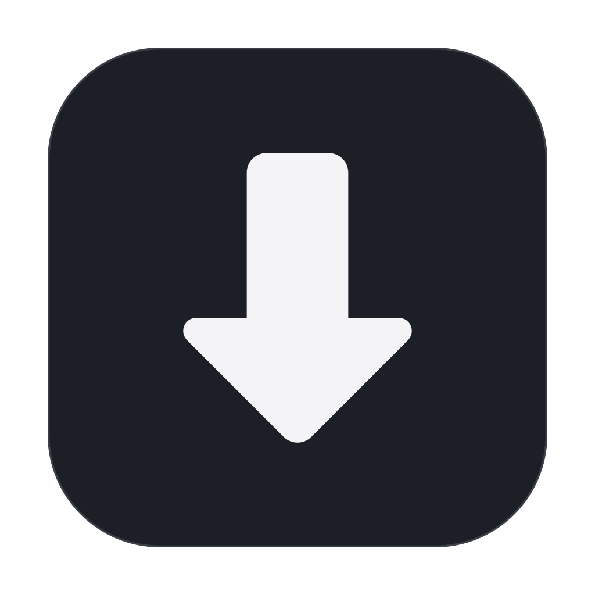
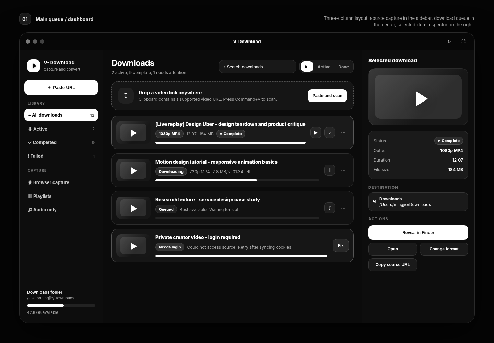

<p align="center">
  <strong>English</strong> | <a href="README.zh-CN.md">简体中文</a>
</p>

<p align="center">
  
</p>

<h1 align="center">V-Download</h1>

<p align="center">
  <strong>Desktop video & audio downloader for macOS and Linux.</strong><br>
  Built with Electron, React, TypeScript, SQLite, yt-dlp, and FFmpeg.
</p>

<p align="center">
  <a href="https://github.com/wangm12/v-download/releases/tag/nightly"></a>
  <a href="https://github.com/wangm12/v-download/releases"></a>
  
  
</p>

<p align="center">
  
</p>

---

## Overview

**V-Download** is an open-source, Downie-style desktop media downloader for macOS and Linux. It pairs the extraction power and site compatibility of `yt-dlp` and `FFmpeg` with a responsive desktop interface and keyboard URL capture.

Whether downloading an 8K HDR YouTube video, extracting Douyin Live Photos (motion photos) and albums, or ripping audio into lossless FLAC, V-Download runs completely locally without subscriptions, cloud accounts, or tracking.

---

## Key Features

- **Instant Keystroke Capture**: Copy any media URL and press **Cmd+V** (or **Ctrl+V** on Linux) to parse and download immediately. No manual URL bar pasting required.
- **Universal Site Support**: Downloads video and audio from YouTube (up to 8K 60fps HDR), Douyin / TikTok, Xiaohongshu, Bilibili, and 1,000+ sites supported by yt-dlp.
- **Douyin Live Photos & Gallery Extraction**: Full-fidelity extraction of Douyin image albums, including high-res stills and individual motion video clips.
- **Queue Scheduler & Concurrency Control**: Configurable concurrency (1–10 parallel downloads), pause/resume, FIFO ordering, automatic retry on transient failures, and duplicate protection.
- **Audio Extraction & Transcoding**: Instant conversion presets for MP3, AAC, Opus, FLAC, WAV, and video transcoding to MP4 (H.264 / H.265) via bundled FFmpeg.
- **YouTube PO Token Automation**: Integrated Rust PO token provider daemon (`bgutil-pot-provider-rs`) running locally on loopback to prevent bot detection.
- **Chrome Companion Extension**: One-click forwarding from Chrome to desktop with cold-start wake support (`vdownload://wake`).
- **Dual-Track Cookie Sync**: Import session cookies from Chrome, Brave, Edge, or Vivaldi. V-Download uses OS-backed encryption when a protected storage backend is available; on Linux without a keyring backend, it protects the cookie file with owner-only permissions. A CLI fallback is also available.
- **Agent & MCP Protocol Server**: Built-in Model Context Protocol server (`POST /mcp` and Stdio), enabling AI agents like Cursor or Claude to query, queue, and manage downloads.
- **First-Class Multi-Platform Support**:
  - **macOS**: Native traffic lights, dark/light appearance sync, Dock progress icon with real-time download speed.
  - **Linux (Ubuntu / Debian)**: CSD window controls (minimize, maximize, close), Unity / GNOME Dash taskbar progress bars, system tray with 22x22 scaling, and `.deb` / `.AppImage` packaging.

---

## Runtime characteristics

Media transfer and conversion run through bundled `yt-dlp` and FFmpeg command-line engines. Performance depends on the source site, selected formats, network, and hardware; this project does not publish reproducible startup, memory, CPU, or database benchmarks.

Packaged builds target macOS 12 or newer and Ubuntu/Debian Linux. The Linux `.deb` declares its required desktop and media runtime libraries. Cookie storage uses OS-backed encryption where a protected backend is available; on Linux without a keyring backend, the app uses owner-only cookie files.

---

## Installation & Downloads

### 1. Prebuilt Installers
Prebuilt installers are available from [GitHub Releases](https://github.com/wangm12/v-download/releases). The release workflow publishes a stable release for matching version tags and updates a rolling nightly release when run manually on a branch:

- **macOS (Apple Silicon & Intel)**:
  - Download `.dmg` from [Releases](https://github.com/wangm12/v-download/releases) or the rolling [Nightly Build](https://github.com/wangm12/v-download/releases/tag/nightly).
  - Open the DMG and drag `V-Download.app` into Applications.
- **Ubuntu / Debian Linux (x64 & arm64)**:
  - Download `.deb` from [Releases](https://github.com/wangm12/v-download/releases) or [Nightly](https://github.com/wangm12/v-download/releases/tag/nightly):
    ```sh
    sudo dpkg -i V-Download-*.deb
    ```
- **Universal Linux (AppImage)**:
  - Download `.AppImage`, make it executable, and run:
    ```sh
    chmod +x V-Download-*.AppImage && ./V-Download-*.AppImage
    ```

Publishing an artifact to GitHub does not by itself establish that the macOS app is signed, notarized, or accepted by Gatekeeper; those checks depend on the configured Apple credentials.

---

## Keyboard Shortcuts

| Shortcut (macOS) | Shortcut (Linux) | Action |
|---|---|---|
| **⌘V** | **Ctrl+V** | Parse URL from clipboard and start download |
| **⌘,** | **Ctrl+,** | Open Preferences / Settings |
| **⌘W** | **Ctrl+W** | Close window (runs in system tray) |
| **⌘Q** | **Ctrl+Q** | Quit application |

---

## Build From Source

Requires Node.js 22.14 or newer in the 22.x line, or 23.6 or newer (including later major versions).

```sh
# Clone repository
git clone https://github.com/wangm12/v-download.git
cd v-download

# Install dependencies
make install

# Build release packages locally for current platform (macOS DMG or Linux deb/AppImage)
make package

# Or build specific packages
make deb       # Build Linux .deb package
make appimage  # Build Linux .AppImage package
make mac       # Build macOS DMG and zip

# Cut a new release and trigger GitHub Actions publish
make release              # Auto-prompts or increments patch version
make release VERSION=1.2.0 # Release explicit version
```

---

## Make Targets & Development

```sh
make dev       # Start development server with hot reload
make build     # Compile SSR main process and Vite frontend
make test      # Run full test suite (40+ integration & contract tests)
make typecheck # TypeScript type checks across all workspaces
make mac       # Package macOS DMG and zip
make deb       # Package Ubuntu / Debian .deb
make linux     # Package all Linux installers (.deb + .AppImage)
make package   # Package local installers for current OS (auto-detects macOS vs Linux)
make release   # Cut semantic release tag & publish via GitHub Actions (make release [VERSION=X.Y.Z])
make clean     # Clean build caches, dist/ and staging directories
```

---

## License

This project is licensed under the [MIT License](LICENSE).
