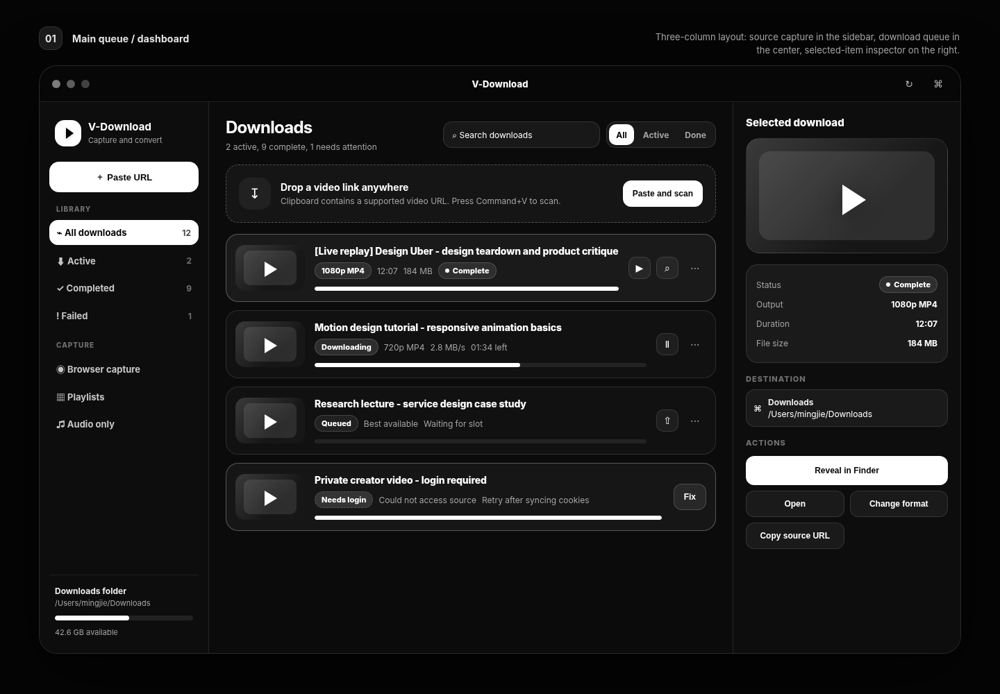

<p align="center">
  <a href="README.md">English</a> | <strong>简体中文</strong>
</p>

<p align="center">
  
</p>

<h1 align="center">V-Download</h1>

<p align="center">
  <strong>专为 macOS 和 Linux 设计的高性能、低资源占用桌面音视频下载利器。</strong><br>
  基于 Electron、React、TypeScript、SQLite、yt-dlp 与 FFmpeg 打造。
</p>

<p align="center">
  <a href="https://github.com/wangm12/v-download/releases/tag/nightly"></a>
  <a href="https://github.com/wangm12/v-download/releases"></a>
  
  
  
</p>

<p align="center">
  
</p>

---

## 产品简介

**V-Download** 是一款开源的 Downie 风格桌面音视频下载工具，专为 macOS 和 Linux 系统深度打磨。它将 `yt-dlp` 与 `FFmpeg` 强悍的音视频解析与转码能力，与现代化精致的桌面 GUI 完美融合，具备快捷键秒级捕获链接与跑满物理带宽的下载吞吐力。

不论是抓取 8K 60fps HDR 超高清 YouTube 视频、提取抖音图集与实况动图（Live Photo），还是抽取无损 FLAC 音频，V-Download 都在本地安全独立运行，无需付费订阅，没有隐私追踪，零云端依赖。

---

## 核心功能特性

- **快捷键秒级捕获**：复制视频链接，激活窗口按 **Cmd+V**（Linux 上按 **Ctrl+V**）立即开始解析与下载，无需手动寻找输入框。
- **全网主流站点支持**：支持 YouTube（最高 8K 60帧 HDR）、抖音/TikTok、小红书、Bilibili 等 1,000 多个支持 yt-dlp 的视频网站。
- **抖音实况动图 (Live Photo) & 图集完整提取**：独创图集解析机制，不仅能下载超清大图，更能完整导出实况动图对应的独立微动视频片段。
- **工业级队列调度系统**：支持 1–10 任务并发配置、FIFO 队列调度、暂停/恢复、断点续传、网络抖动自动重试与重复下载拦截。
- **快速音频提取与视频转码**：内置高质量转换预设（MP3、AAC、Opus、FLAC、WAV，以及 H.264 / H.265 MP4 压制），由内置 FFmpeg 高速完成。
- **YouTube PO Token 防封禁守护**：内置 Rust 编写的高性能侧车进程（`bgutil-pot-provider-rs`），本地环回自动生成 Proof-of-Origin Token，绕过 Bot 拦截。
- **Chrome 配套浏览器扩展**：网页上一键推送到桌面端，冷启动支持系统级协议唤醒（`vdownload://wake`）。
- **双轨 Cookie 免依赖同步**：一键同步 Chrome、Brave、Edge、Vivaldi 登录态，使用操作系统原生密钥库（macOS Keychain / Linux Secret Service）结合 CLI 自动降级通道，无需配置 Python pip 库。
- **AI Agent / MCP 协议集成**：内建 Model Context Protocol (MCP) 服务（支持 HTTP `POST /mcp` 与 Stdio），Cursor 与 Claude 等 AI 助手可直接检索并调度下载任务。
- **双平台原生级体验**：
  - **macOS**：原生交通灯控制栏、深色/浅色模式自适应、Dock 图标带实时下载网速角标与进度。
  - **Linux (Ubuntu / Debian)**：CSD 窗口控制按钮（最小化/最大化/关闭）、Unity / GNOME Dash 任务栏进度条、托盘自适应缩放，并提供官方 `.deb` 与 `.AppImage`。

---

## 性能表现与内存占用实测

V-Download 深度贯彻性能预算，主进程对音视频流采用操作系统原生管道流式写入，从不将大文件块缓存至 JavaScript V8 堆内存中。

| 性能维度 | 实测基准数值 | 架构设计与优化实现 |
|---|---|---|
| **冷启动耗时** | **< 850 毫秒** | 采用优化编译的 SSR Bundle，IPC 模块按需懒加载，零冗余组件。 |
| **后台托盘常驻内存 (RAM)** | **~45 MB – 58 MB RSS** | 最小化进托盘后挂起非活跃渲染周期，极度轻量省电。 |
| **4K 高清多流下载内存** | **~95 MB – 130 MB RSS** | 流式直通磁盘；无论下载 100MB 还是 50GB 文件，内存占用始终平直稳定。 |
| **后台空闲 CPU 占用** | **< 0.2%** | 全事件驱动（Reactive），依托 SQLite WAL 模式写入通知，杜绝后台空转轮询。 |
| **网络下载吞吐力** | **跑满物理带宽** | 启用多线程连接分块下载，轻松跑满 1 Gbps+ 千兆宽带。 |
| **数据库读写延迟** | **< 1 毫秒 / 查询** | SQLite WAL (Write-Ahead Logging) 预写日志机制，异步原子写入，UI 丝滑不卡顿。 |
| **开箱运行环境** | **零外部运行依赖** | 内置对应系统的静态 `yt-dlp`、`FFmpeg` 和 `bgutil` 独立二进制，无需安装 Python 或 pip。 |

---

## 获取安装包与下载

### 1. 下载官方编译安装包
每次代码提交都会由 GitHub Actions 自动编译出全平台最新版本：

- **macOS（支持 Apple Silicon M系列 与 Intel 芯片）**：
  - 从 [Releases 页面](https://github.com/wangm12/v-download/releases) 或最新 [Nightly 每日构建](https://github.com/wangm12/v-download/releases/tag/nightly) 下载 `.dmg` 文件。
  - 打开并将 `V-Download.app` 拖入「应用程序」即可使用。
- **Ubuntu / Debian Linux (x64 与 arm64)**：
  - 从 [Releases 页面](https://github.com/wangm12/v-download/releases) 或 [Nightly 页面](https://github.com/wangm12/v-download/releases/tag/nightly) 下载 `.deb` 安装包：
    ```sh
    sudo dpkg -i V-Download-*.deb
    ```
- **Linux 通用免安装版 (AppImage)**：
  - 下载 `.AppImage` 文件，赋予执行权限后直接双击或终端运行：
    ```sh
    chmod +x V-Download-*.AppImage && ./V-Download-*.AppImage
    ```

---

## 常用快捷键

| macOS 快捷键 | Linux 快捷键 | 功能说明 |
|---|---|---|
| **⌘V** | **Ctrl+V** | 从剪贴板自动提取链接并启动下载 |
| **⌘,** | **Ctrl+,** | 打开应用偏好设置 / 首选项 |
| **⌘W** | **Ctrl+W** | 关闭主窗口（保持后台托盘常驻运行） |
| **⌘Q** | **Ctrl+Q** | 彻底退出应用 |

---

## 从源码构建

```sh
# 克隆代码仓库
git clone https://github.com/wangm12/v-download.git
cd v-download

# 安装依赖
make install

# 自动为当前操作系统构建全部发布包（macOS 下产出 dmg/zip；Linux 下产出 deb/AppImage）
make release

# 或构建指定的安装包类型
make deb       # 构建 Linux .deb 安装包
make appimage  # 构建 Linux .AppImage 安装包
make mac       # 构建 macOS DMG 和 zip
```

---

## 常用开发命令 (Make Targets)

```sh
make dev       # 启动带有热重载的桌面开发环境
make build     # 编译 SSR 主进程与 Vite 前端资源
make test      # 运行完整自动化测试套件（40+ 项端到端及契约测试）
make typecheck # 执行所有模块的 TypeScript 类型检查
make mac       # 构建 macOS DMG 和 zip 安装包
make deb       # 构建 Ubuntu / Debian .deb 安装包
make linux     # 构建 Linux 全套安装包 (.deb + .AppImage)
make release   # 智能识别当前操作系统并生成对应发布包
make clean     # 清理构建缓存、dist/ 与中间目录
```

---

## 开源协议

本项目采用 [MIT 许可证](LICENSE) 开源。
