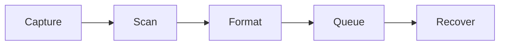
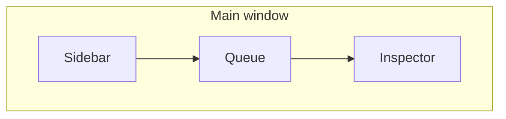

# V-Download — full design plan

This document unifies [design/v-download-bw-redesign-pack/specs/redesign-spec.md](../design/v-download-bw-redesign-pack/specs/redesign-spec.md), [mockup-index.md](../design/v-download-bw-redesign-pack/specs/mockup-index.md), [tokens/design-tokens.json](../design/v-download-bw-redesign-pack/tokens/design-tokens.json), and [design/v-download-bw-redesign-pack/README.md](../design/v-download-bw-redesign-pack/README.md). Use it as the single narrative for product, design, and engineering alignment. **Authoritative pixels and copy** remain in the pack; this plan adds structure, acceptance framing, and traceability.

---

## 1. Vision and product story

**What V-Download is:** A Downie-style desktop pipeline: capture URL or page → scan for media → recommend format → queue downloads → recover failures in plain language.

**What the redesign changes:** Remove decorative color. The product reads as **restrained, premium, utility-first**: black surfaces, white primary actions, gray typography, **status by label + shape + border**, not hue.

**Non-goals for the design system:** No green/red/yellow/purple/blue semantics for success or error; no gradients except subtle thumbnail placeholders; no neon, glow, or colored shadows.

---

## 2. Design principles (checklist)

| Principle | Meaning | Verify |
|-----------|---------|--------|
| Monochrome only | Palette from tokens; no semantic hue | Visual + hex audit |
| One primary action | Single white CTA per modal/sheet | Screen review |
| Status = text + shape | Pills, borders, dashed = problem | No color-only state |
| Hierarchy over hue | Contrast, weight, spacing drive priority | Typography scale |
| Modals are rare | Paste URL, format decision, browser guide only | IA audit |
| Thumbnails neutral | Placeholder = black–gray gradient until loaded | Empty thumb states |

---

## 3. Design system (source of truth)

**Canonical file:** [design/v-download-bw-redesign-pack/tokens/design-tokens.json](../design/v-download-bw-redesign-pack/tokens/design-tokens.json).

**Layers (from spec):** App `#050505` → Window `#0B0B0B` → Sidebar/Inspector `#0D0D0D` → Surfaces `#111111` / `#161616` / `#1C1C1C` → Borders `rgba(255,255,255,0.12–0.22)` → Text primary / secondary / tertiary → Primary action white fill, `#050505` text.

**State tokens (semantic):** `active`, `complete`, `queued`, `error` (neutral backgrounds + borders; error may use **dashed** border per spec).

**Typography, spacing, radius, shadow, layout:** Defined in JSON (e.g. window title 13px/800, row height 98px, sidebar 244px, inspector 328px). Implementation maps these into app theming (e.g. Tailwind); **design QA** compares rendered app to [exports/png/14-component-library.png](../design/v-download-bw-redesign-pack/exports/png/14-component-library.png).

**Light mode:** Spec Phase 4 + mockup `15-white-mode.png` — same monochrome **language**, inverted surfaces; not required for initial ship.

---

## 4. Information architecture

| Zone | Purpose | Spec section |
|------|---------|----------------|
| **Sidebar** | App icon + **Downloads** list (filter via queue search), link to **Preferences**, capture modes (future); **Cmd+V** / drop for URLs (no sidebar Paste button) | redesign-spec §Sidebar |
| **Queue** | Search, drop/paste banner, download rows, **batch controls** when multi-select / playlist | redesign-spec §Center queue |
| **Inspector** | Selection detail: preview, format, metrics, destination, actions (Open, Reveal, Change format, Retry, Sync cookies) | redesign-spec §Right inspector |
| **Preferences** | **In-app:** the **same 244px sidebar** lists **Queue** (download queue) and **Settings** (General → Sites, then **Advanced** below a gap) on one home shell—no separate prefs-only sidebar. The center swaps between queue+inspector and [`PreferencesPanel`](src/renderer/src/components/PreferencesPanel.tsx) (section title header, grouped cards; **Downloads** aligns with v2 `02-preferences-downloads`: Storage, Queue, Output format). **Sites** stub; compact modal (`06`) remains a fallback | v2 settings pack |
| **Chrome** | Custom title bar: traffic-light inset (macOS), **inspector collapse** + **appearance menu** (Dark / Light / Device) on the right; optional bottom status/actions bar | Mockups 01, 07 |

**Deep link:** Loading the app with `#/settings` still opens Preferences (hash is normalized after load).

**Bottom bar:** Hidden while Preferences is visible so queue actions are not offered out of context.

**Empty inspector:** Never “blank” — tips + global folder/summary when nothing selected.

---

## 5. Screen catalog (behavior + mockup + engineering phase)

| # | Screen | Mockup PNG / PDF | Core behavior | Phase |
|---|--------|------------------|----------------|-------|
| — | Cover / direction | `00-cover.png` | Onboarding for stakeholders | — |
| 1 | Main queue / dashboard | `01-main-queue-dashboard.png` | Three columns, selection drives inspector | 1 |
| 2 | Empty / first launch | `02-empty-first-launch.png` | Teach paste, drag, browser companion | 1–2 |
| 3 | Paste URL flow | `03-paste-url-flow.png` | **Sheet**: validate URL, options (picker, cookies, subfolder, audio, destination) | 2 |
| 4 | Scanning | `04-scanning-state.png` | Step list + Cancel + Show scan log | 2 |
| 5 | Format picker | `05-format-picker.png` | Recommended rows, sizes, **Download selected** | 2 |
| 6 | Playlist detected | `06-playlist-detected.png` | Batch select, preset format, grouping, duplicates, captions | 2 |
| 7 | Active downloads | `07-active-downloads.png` | Speed, ETA, pause/resume, **priority**, batch | 2–3 |
| 8 | Completed detail | `08-completed-detail.png` | Open, Reveal, **copy link**, remove | 2–3 |
| 9 | Error recovery | `09-error-recovery.png` | Plain-language + Sync cookies / Open page / Retry / Show log | 3 |
| 10 | Preferences — General | `10-preferences-general.png` | Sectioned prefs | 3 |
| 11 | Preferences — Browser | `11-preferences-browser.png` | Extension, sync, profiles, privacy | 3 |
| 12 | Browser companion guide | `12-extension-guide.png` | Dedicated guide surface | 3 |
| 13 | Compact mode | `13-compact-mode.png` | Mini window: capture + progress + Pause all + open full | 3 |
| 14 | Component library | `14-component-library.png` | QA reference | ongoing |
| 15 | White mode | `15-white-mode.png` | Light appearance variant | 4 |

**Interactive board:** [design/v-download-bw-redesign-pack/index.html](../design/v-download-bw-redesign-pack/index.html).

**Combined PDF:** [design/v-download-bw-redesign-pack/exports/pdf/v-download-bw-redesign-mockups.pdf](../design/v-download-bw-redesign-pack/exports/pdf/v-download-bw-redesign-mockups.pdf).

---

## 6. Component library (rules)

Summarized from redesign-spec §Component rules; detail in mockup `14` + tokens.

- **Buttons:** Primary = white fill + dark text; secondary = transparent / `control` surface; destructive/recovery = **no red** — dashed or strong border + clear copy.
- **Status pills:** Neutral only; always paired with **text**; dot + label where useful.
- **Download rows:** Thumbnail, title, metadata, progress when active, status pill, **limited** inline actions; selection = stronger surface + border (align row treatment with sidebar filter chips).
- **Inspector:** Mirrors selection; empty state = tips + folder.
- **Modals / sheets:** Paste URL, format picker, browser setup guide only (other flows inline or inspector-first).

---

## 7. Copy and content

**Global:** Apply [redesign-spec §Copy guidelines](../design/v-download-bw-redesign-pack/specs/redesign-spec.md) table (format picker toggle, subfolders, sync wording, Douyin browser label, “Best available”, scanning string).

**Error strings:** User-facing problem statements, not raw logs (recovery screen).

**Keyboard (target):** [redesign-spec suggested shortcuts](../design/v-download-bw-redesign-pack/specs/redesign-spec.md) — document in app help or settings; implement in Phase 4 (or incrementally when selection model supports ⌘O / ⌘R / Space / Delete). **Shipped:** **⌘,** / **Ctrl+,** and the app menu **Settings…** item open in-app Preferences (see README shortcut table).

---

## 8. Accessibility (non-negotiable)

From redesign-spec §Accessibility notes:

- Visible **focus** on buttons, rows, inputs (`focus-visible` rings aligned to token `border-focus`).
- Status never color-only; minimum **13–14px** row titles.
- High contrast on primary and recovery actions.
- **Reduced motion** for scanner and progress animations (respect `prefers-reduced-motion`).

---

## 9. Delivery roadmap (design + eng)

| Phase | Design outcome | Eng acceptance (high level) |
|-------|----------------|----------------------------|
| **1** | Monochrome shell, 3-column IA, neutral queue/rows, drop banner + **Cmd+V** for URLs, basic inspector | Tokens applied; layout matches 01; no hue status |
| **2** | Paste sheet, scanning UI, new format picker, playlist batch UX | Flows match 03–06; parity with yt-dlp queue |
| **3** | Recovery, prefs sections, extension guide, compact window | Match 09–13; settings IA split |
| **4** | White mode, motion, shortcuts, a11y polish | Match 15 + shortcut table; reduced-motion |

**Out of scope for this design plan (product backlog):** See [FUTURE_ENHANCEMENTS.md](./FUTURE_ENHANCEMENTS.md) (Douyin hydration, vdl-server parity, experimental CloakBrowser, etc.) — **orthogonal** to monochrome IA unless a screen explicitly references them (e.g. cookie sync).

---

## 10. Governance

- **Change control:** Visual or IA changes update mockups + `redesign-spec.md` + this document.
- **QA:** Per milestone, walk mockup index vs build using [MANUAL_TESTING.md](./MANUAL_TESTING.md) (including the mockup checklist section).
- **Tokens:** Single source `design-tokens.json`; app theme must not drift without token bump.

---

## 11. Pack layout (quick reference)

| Path | Contents |
|------|----------|
| `design/v-download-bw-redesign-pack/specs/redesign-spec.md` | UX rationale, screen behavior, component rules, implementation priority |
| `design/v-download-bw-redesign-pack/specs/mockup-index.md` | PNG/PDF index |
| `design/v-download-bw-redesign-pack/tokens/design-tokens.json` | Color, type, spacing, radius, shadow, layout |
| `design/v-download-bw-redesign-pack/exports/png/` | Individual mockups |
| `design/v-download-bw-redesign-pack/exports/pdf/` | Combined mockups PDF |
