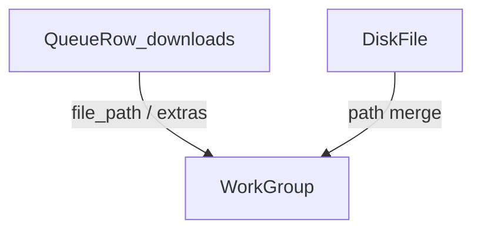

# Library Phase A — design

**Status:** spec only (not implemented)  
**Product:** keep V-Download a Downie-style downloader ([PRODUCT_DIRECTION.md](../../PRODUCT_DIRECTION.md))  
**Plan:** [../plans/2026-08-31-library-phase-a.md](../plans/2026-08-31-library-phase-a.md)

## Problem

The main window is a **live queue**. Playlist groups answer “this batch is downloading.” They do not answer “what is already on disk, including galleries and leftovers after the queue row is gone.”

## Goal

Give completed downloads a searchable, grouped home **without a second media database**. Library reads:

1. Existing SQLite `downloads` / `playlists` rows ([`src/main/database.ts`](../../../src/main/database.ts))
2. Files under `settings.downloadDir` (and playlist / author subfolders)

Phase A is browse + Reveal + delete + refresh. **Open with the OS.** No in-app player.

## Non-goals

- New SQLite media index, tags, ratings, or watch history
- Immersive player, RSS, media-server features
- Recursively indexing the whole home directory
- Copying better-douyin source (learn grouping ideas only)

## Data model (three layers, one store)

### Queue row (already exists)

`DownloadRecord`: `id`, `url`, `title`, `status`, `file_path`, `file_size`, `thumbnail`, `channel`, `playlist_id`, `playlist_index`, `extras` (JSON: `awemeId`, `douyinImageUrls`, `douyinMediaType`, …), timestamps.

`complete` rows are first-class Library members. Rows whose `file_path` is missing or deleted still appear as **missing** until the user removes the record.

### Disk file (scan, not persisted)

| Field | Source |
|-------|--------|
| `path` | realpath under `downloadDir` |
| `size`, `mtime` | `stat` |
| `mediaKind` | extension: video / image / audio / other |
| `fileName` | basename |

Skip: `.part`, `.ytdl`, `ffmpeg2pass*`, `compressed_*`, dotfiles (same idea as [`isIgnoredArtifactName`](../../../src/main/apiJobsModel.ts)).

Do **not** scan `{downloadDir}/remote-jobs/` in the default Library list (those files belong to the Remote Job API sandbox).

### Work group (derived)

One capture that may produce many files (gallery, Live Photo still+video, cover, BGM).

**Key (first match):**

1. `extras.awemeId` or other stable site id in extras
2. `playlist_id` + `playlist_index` when both set (one playlist entry)
3. Canonical page URL (strip ephemeral query params — reuse [`mediaIdentity`](../../../src/main/mediaIdentity.ts) ideas)
4. Fallback: `(channel or parent folder) + normalized title`

**Title normalize (for fallback only):** strip known media extensions; peel trailing `(1)`, `_cover`, `_live_photo`, `第N张`. Implement in **our** helper; do not port better-douyin code.

A work’s `items` are disk files merged onto matching queue rows (join on `file_path`). Cover prefers `thumbnail`, else first image, else first video.

## Views

| Mode | Unit | Default page size |
|------|------|-------------------|
| **File** | one disk file / one complete row | 24 (options 12 / 24 / 48 / 96) |
| **Work** | one work group | same pager |

Shared chrome: search (`title`, `channel`, `filename`), type filter (all / video / image / audio), sort (date desc/asc, size desc/asc), selection, Reveal, delete, refresh.

Queue **Active** tasks stay in the existing Downloads list. Library is the **completed / on-disk** surface. Sidebar can add a Library entry later; Phase A may live as a filter or a second main view (`downloads | library | preferences`) without new product pillars.

## Actions

| Action | Behavior |
|--------|----------|
| Reveal | existing `openFileLocation` |
| Open | existing `openFile` (OS handler) |
| Delete file | confirm; unlink owned paths under `downloadDir` only; drop matching SQLite row if `file_path` matches |
| Delete work | delete all items in the group (same path guard) |
| Refresh | rescan page; merge again |

Path guard: refuse delete/reveal outside `downloadDir` (same spirit as remote-job `isPathInside`).

## Main-process API (proposed)

Keep UI on a narrow contract (preload), e.g.:

- `library.listFiles({ offset, limit, query, mediaType, sortBy, forceRefresh })`
- `library.listWorks({ … })` — or list files + let renderer group for small pages; **main must group** once the download dir is large
- `library.deletePaths(paths: string[])`

Cache the scan for a few seconds; `forceRefresh` busts it.

## Tests

- Work key: aweme extras beat title; title fallback peels `_cover`
- Merge: disk file without row still lists; row without file is `missing`
- `remote-jobs/` excluded
- Delete refuses path outside `downloadDir`
- Pagination + search do not load the entire tree into the renderer on every keystroke (debounce / `useDeferredValue` is fine)

## Acceptance

- User can find a finished Douyin gallery as **one work** and as **N files**
- Reveal and delete work on both views
- Queue behavior unchanged
- No player chrome
